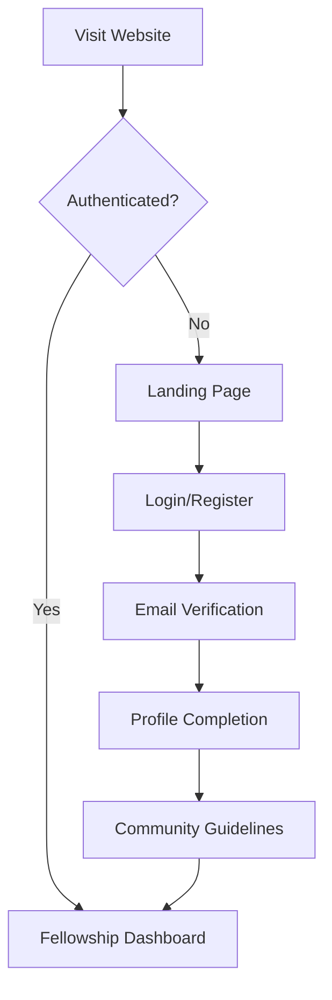

# Authentication Requirements
## The Church - Fellowship of the Believers

### Table of Contents
1. [Authentication Overview](#authentication-overview)
2. [Login-Required Access Model](#login-required-access-model)
3. [User Registration Flow](#user-registration-flow)
4. [Security Implementation](#security-implementation)
5. [Access Control Matrix](#access-control-matrix)
6. [Biblical Justification](#biblical-justification)

---

## Authentication Overview

### Core Principle
**"The Church - Fellowship of the Believers"** requires authenticated access to protect the sacred nature of Christian fellowship and ensure a safe environment for believers to gather, share, and worship together.

### Authentication Requirements
- **All content requires login** - No anonymous access
- **Email verification mandatory** - Confirm identity before access
- **Profile completion required** - Basic Christian testimony and fellowship preferences
- **Community guidelines acceptance** - Agree to biblical fellowship standards
- **Optional but encouraged**: Social authentication (Google, GitHub) for ease of access

---

## Login-Required Access Model

### Public Pages (No Authentication Required)
```
/                          # Landing page with login/register
/about                     # About our biblical fellowship
/biblical-foundation       # New Testament principles overview
/login                     # Authentication page
/register                  # Registration page
/forgot-password          # Password reset
/privacy                   # Privacy policy
/terms                     # Terms of service
```

### Protected Pages (Authentication Required)
```
/fellowship               # Main fellowship dashboard
/fellowship/events        # Fellowship events and scheduling
/fellowship/chat/:id      # Live fellowship chat rooms
/bible                    # Bible search and study tools
/bible/study              # Group Bible studies
/prayer                   # Prayer requests and responses  
/prayer/groups            # Prayer group formations
/community               # Community discussions
/profile                 # User profile and preferences
/settings                # Account settings
/admin                   # Administrative functions (role-based)
```

### Authentication Flow


---

## User Registration Flow

### Step 1: Initial Registration
```typescript
interface RegistrationData {
  email: string
  password: string
  fullName: string
  agreeToTerms: boolean
  agreeToGuidelines: boolean
}
```

### Step 2: Email Verification
- Send verification email with secure token
- Require click-through verification before access
- Token expires in 24 hours

### Step 3: Profile Completion (Required)
```typescript
interface UserProfile {
  // Required fields
  username: string              // Unique identifier for fellowship
  fullName: string             // Display name in community
  testimony: string            // Brief Christian testimony (100-500 chars)
  fellowshipInterests: string[] // Areas of interest for fellowship
  
  // Optional fields
  bio?: string                 // Additional personal information
  location?: string            // General location for local connections
  favoriteVerses?: string[]    // Favorite Bible verses
  avatarUrl?: string          // Profile picture
  
  // Fellowship preferences
  fellowshipPreferences: {
    eventTypes: string[]       // Types of events interested in
    availableTimes: string[]   // Preferred fellowship times
    studyInterests: string[]   // Bible study topics of interest
    prayerTopics: string[]     // Prayer focus areas
  }
}
```

### Step 4: Community Guidelines Acceptance
```typescript
interface CommunityGuidelines {
  biblicalConduct: boolean      // Agree to biblical standards
  respectfulCommunication: boolean // Commit to Christ-like communication
  doctrinalGrace: boolean       // Grace in doctrinal discussions
  prayerfulParticipation: boolean // Commitment to prayer-centered fellowship
  authenticity: boolean         // Authentic sharing and transparency
}
```

---

## Security Implementation

### Supabase Authentication Configuration
```sql
-- Enable Row Level Security on all tables
ALTER TABLE profiles ENABLE ROW LEVEL SECURITY;
ALTER TABLE fellowship_events ENABLE ROW LEVEL SECURITY;
ALTER TABLE fellowship_messages ENABLE ROW LEVEL SECURITY;
ALTER TABLE prayer_requests ENABLE ROW LEVEL SECURITY;

-- Base authentication policy
CREATE POLICY "Authenticated users only" ON profiles
  FOR ALL USING (auth.role() = 'authenticated');

-- Profile access policy
CREATE POLICY "Users can view completed profiles" ON profiles
  FOR SELECT USING (
    auth.uid() IS NOT NULL AND 
    profile_completed = TRUE AND
    email_verified = TRUE
  );

-- Self-profile management
CREATE POLICY "Users can manage own profile" ON profiles
  FOR ALL USING (auth.uid() = id);
```

### Authentication Middleware
```typescript
// middleware.ts
import { createMiddlewareClient } from '@supabase/auth-helpers-nextjs'
import { NextResponse } from 'next/server'
import type { NextRequest } from 'next/server'

const publicRoutes = [
  '/',
  '/about',
  '/biblical-foundation',
  '/login',
  '/register',
  '/forgot-password',
  '/privacy',
  '/terms'
]

export async function middleware(req: NextRequest) {
  const res = NextResponse.next()
  const pathname = req.nextUrl.pathname

  // Allow public routes
  if (publicRoutes.includes(pathname) || pathname.startsWith('/api/auth/')) {
    return res
  }

  // Check authentication for protected routes
  const supabase = createMiddlewareClient({ req, res })
  const { data: { session } } = await supabase.auth.getSession()

  if (!session) {
    const loginUrl = new URL('/login', req.url)
    loginUrl.searchParams.set('redirect', pathname)
    return NextResponse.redirect(loginUrl)
  }

  // Check if profile is complete
  const { data: profile } = await supabase
    .from('profiles')
    .select('profile_completed, email_verified, guidelines_accepted')
    .eq('id', session.user.id)
    .single()

  if (!profile?.email_verified) {
    return NextResponse.redirect(new URL('/verify-email', req.url))
  }

  if (!profile?.profile_completed) {
    return NextResponse.redirect(new URL('/complete-profile', req.url))
  }

  if (!profile?.guidelines_accepted) {
    return NextResponse.redirect(new URL('/community-guidelines', req.url))
  }

  return res
}

export const config = {
  matcher: [
    '/((?!_next/static|_next/image|favicon.ico|public/).*)',
  ],
}
```

### Enhanced Database Schema
```sql
-- Extended profiles table for fellowship
CREATE TABLE profiles (
  id UUID REFERENCES auth.users(id) PRIMARY KEY,
  username TEXT UNIQUE NOT NULL,
  full_name TEXT NOT NULL,
  email TEXT NOT NULL,
  bio TEXT,
  testimony TEXT NOT NULL CHECK (length(testimony) BETWEEN 100 AND 500),
  location TEXT,
  avatar_url TEXT,
  
  -- Verification flags
  email_verified BOOLEAN DEFAULT FALSE,
  profile_completed BOOLEAN DEFAULT FALSE,
  guidelines_accepted BOOLEAN DEFAULT FALSE,
  
  -- Fellowship preferences (JSONB for flexibility)
  fellowship_preferences JSONB DEFAULT '{
    "eventTypes": [],
    "availableTimes": [],
    "studyInterests": [],
    "prayerTopics": []
  }'::jsonb,
  
  favorite_verses TEXT[],
  
  -- Timestamps
  created_at TIMESTAMP WITH TIME ZONE DEFAULT NOW(),
  updated_at TIMESTAMP WITH TIME ZONE DEFAULT NOW(),
  last_seen_at TIMESTAMP WITH TIME ZONE DEFAULT NOW(),
  
  -- Community standing
  community_status TEXT DEFAULT 'active' CHECK (community_status IN ('active', 'inactive', 'suspended')),
  
  CONSTRAINT valid_email CHECK (email ~* '^[A-Za-z0-9._%-]+@[A-Za-z0-9.-]+\.[A-Za-z]{2,}$'),
  CONSTRAINT valid_username CHECK (username ~* '^[a-zA-Z0-9_]{3,30}$')
);

-- Create indexes for performance
CREATE INDEX idx_profiles_username ON profiles(username);
CREATE INDEX idx_profiles_email_verified ON profiles(email_verified);
CREATE INDEX idx_profiles_profile_completed ON profiles(profile_completed);
CREATE INDEX idx_profiles_community_status ON profiles(community_status);

-- Function to check if user can access fellowship features
CREATE OR REPLACE FUNCTION can_access_fellowship(user_id UUID)
RETURNS BOOLEAN AS $$
BEGIN
  RETURN EXISTS (
    SELECT 1 FROM profiles 
    WHERE id = user_id 
    AND email_verified = TRUE 
    AND profile_completed = TRUE 
    AND guidelines_accepted = TRUE
    AND community_status = 'active'
  );
END;
$$ LANGUAGE plpgsql SECURITY DEFINER;
```

---

## Access Control Matrix

### User Roles and Permissions

| Role | Description | Permissions |
|------|-------------|-------------|
| **New User** | Just registered, email not verified | View public pages only |
| **Verified User** | Email verified, profile incomplete | Access profile completion flow |
| **Member** | Full profile, guidelines accepted | Full fellowship access |
| **Elder** | Trusted community member | Moderation capabilities |
| **Administrator** | System administrator | Full system access |

### Feature Access Matrix

| Feature | New User | Verified | Member | Elder | Admin |
|---------|----------|----------|--------|-------|-------|
| Landing Page | ✅ | ✅ | ✅ | ✅ | ✅ |
| Fellowship Events | ❌ | ❌ | ✅ | ✅ | ✅ |
| Live Chat | ❌ | ❌ | ✅ | ✅ | ✅ |
| Bible Study | ❌ | ❌ | ✅ | ✅ | ✅ |
| Prayer Requests | ❌ | ❌ | ✅ | ✅ | ✅ |
| Create Events | ❌ | ❌ | ✅ | ✅ | ✅ |
| Moderate Chat | ❌ | ❌ | ❌ | ✅ | ✅ |
| User Management | ❌ | ❌ | ❌ | ❌ | ✅ |

---

## Biblical Justification

### Scripture Foundation for Protected Fellowship

#### Matthew 18:15-20 - Church Discipline and Gathering
> **"If your brother or sister sins, go and point out their fault, just between the two of you. If they listen to you, you have won them over. But if they will not listen, take one or two others along... If they still refuse to listen, tell it to the church; and if they refuse to listen even to the church, treat them as you would a pagan or a tax collector."**

- **Application**: Authenticated community allows for proper accountability and restoration processes

#### 1 Corinthians 5:12-13 - Judgment Within the Church
> **"What business is it of mine to judge those outside the church? Are you not to judge those inside? God will judge those outside. 'Expel the wicked person from among you.'"**

- **Application**: Protected fellowship space allows for biblical community standards

#### 2 Timothy 3:5 - Avoiding False Forms of Godliness
> **"Having a form of godliness but denying its power. Have nothing to do with such people."**

- **Application**: Profile requirements help ensure genuine believers participate

#### 1 John 4:1 - Testing the Spirits
> **"Dear friends, do not believe every spirit, but test the spirits to see whether they are from God."**

- **Application**: Registration process allows for discernment of authentic fellowship seekers

### Fellowship Protection Benefits

1. **Sacred Space**: Creates environment for vulnerable sharing and prayer
2. **Authentic Community**: Ensures participants are committed to biblical fellowship
3. **Protection from Harm**: Prevents trolling, false teaching, and disruption
4. **Accountability**: Enables biblical community standards and restoration
5. **Deep Fellowship**: Allows for meaningful relationships and spiritual growth

---

## Implementation Checklist

### Pre-Launch Security Verification

- [ ] All pages except public routes require authentication
- [ ] Email verification working correctly
- [ ] Profile completion flow tested
- [ ] Community guidelines acceptance tracked
- [ ] Row Level Security policies active
- [ ] Rate limiting implemented
- [ ] Password security requirements enforced
- [ ] Session management secure
- [ ] Two-factor authentication available
- [ ] Account recovery process tested

### User Experience Verification

- [ ] Registration flow intuitive and biblical
- [ ] Profile completion encourages authentic sharing
- [ ] Community guidelines clearly explain expectations
- [ ] Error messages helpful and gracious
- [ ] Mobile responsive authentication
- [ ] Social login options working
- [ ] Accessibility compliance in auth flows
- [ ] Loading states and progress indicators
- [ ] Graceful error handling
- [ ] Clear navigation for new users

This authentication system ensures "The Church - Fellowship of the Believers" maintains the sacred nature of Christian fellowship while providing secure, user-friendly access to our biblical community platform.